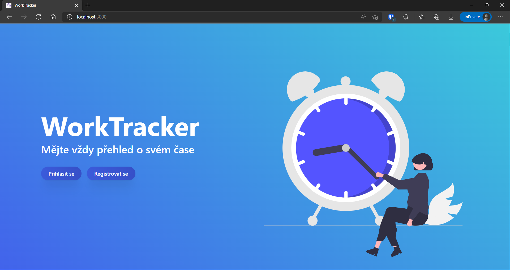
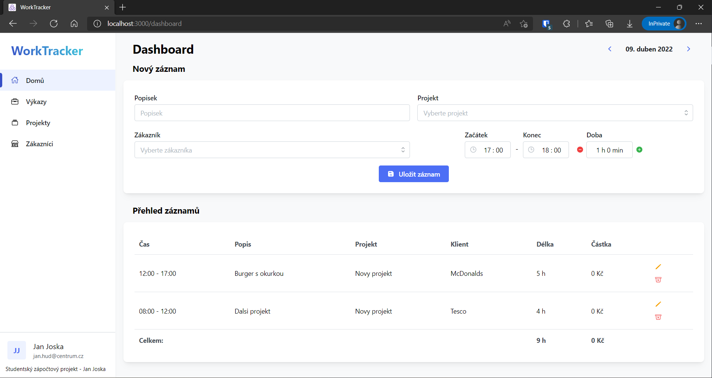
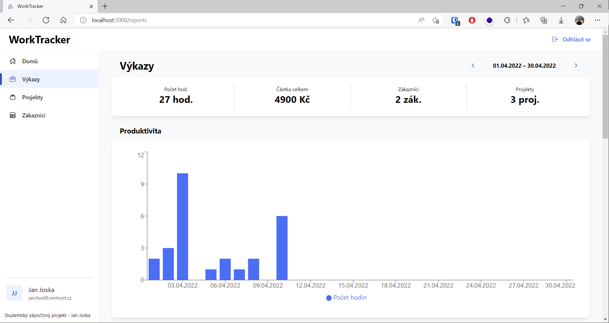
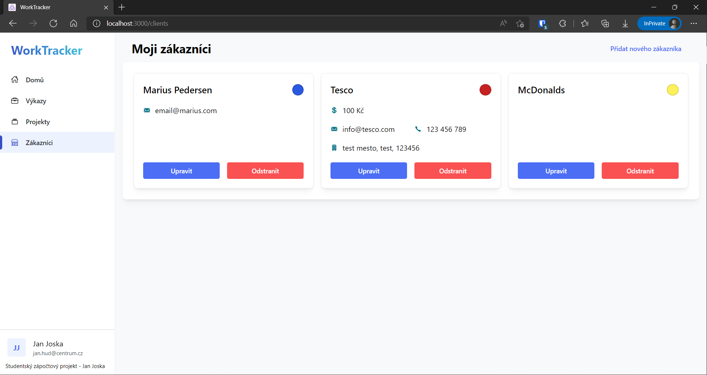
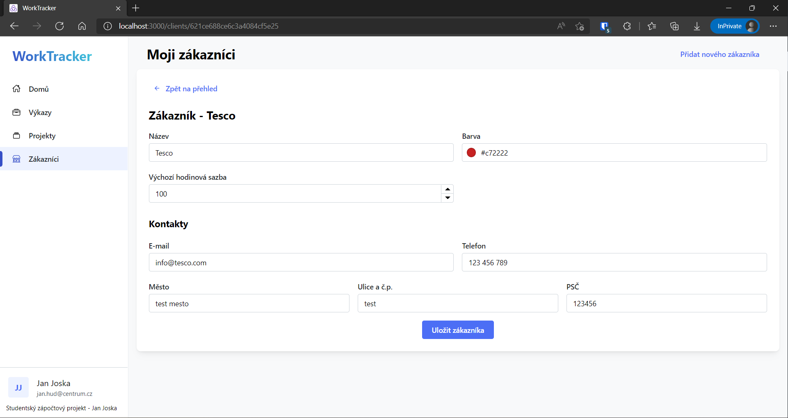

# WorkTracker

WorkTracker is an app for recording your (work) sessions 
and gives you reports about how your time was spent.  

Demo: https://worktracker.joska-jan.cz/

Prerequisites
---------
- [MongoDB](https://www.mongodb.com/)
- [Node](https://nodejs.org/en/download/)
- [npm](https://nodejs.org/en/download/package-manager/)

Installation
---------

**Needed ENV variables:**
```
NODE_ENV = development / production
PORT = 5000
MONGO_URI = MongoDB connection string 
JWT_SECRET = JWT secret string 
```

**Build:**  
`npm install && npm install --prefix frontend`  

**Run:**  
`npm run dev`

Screenshots
---------









