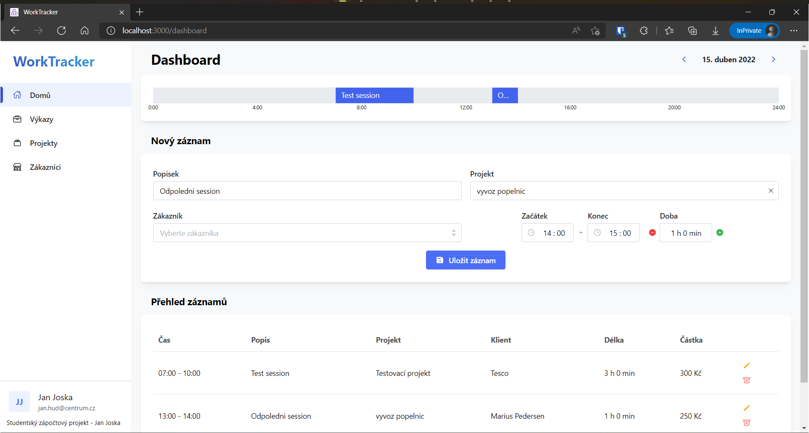

# WorkTracker

Prerequisites
---------
- [MongoDB](https://www.mongodb.com/)
- [Node](https://nodejs.org/en/download/)
- [npm](https://nodejs.org/en/download/package-manager/)

Installation
---------
1. `npm i`
2. `cd frontend`
3. `npm i`
4. Configure MONGO_URI in root .env file

To start project run from root directory:
`npm run server`
`npm run client`

