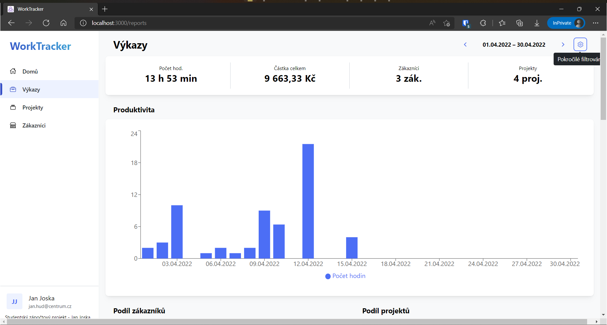
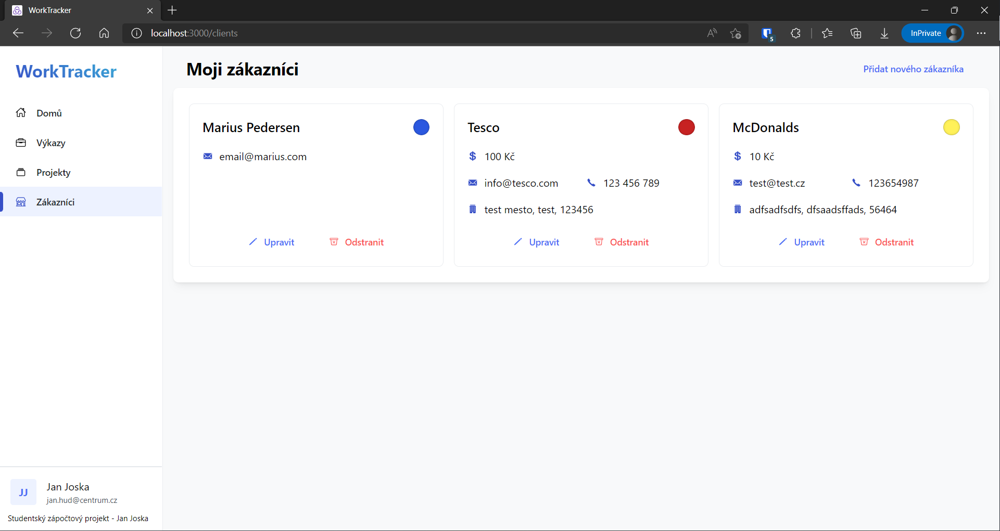

# WorkTracker

WorkTracker is an app for recording your (work) sessions 
and gives you reports about how your time was spent.

Prerequisites
---------
- [MongoDB](https://www.mongodb.com/)
- [Node](https://nodejs.org/en/download/)
- [npm](https://nodejs.org/en/download/package-manager/)

Installation
---------
**Build**  

`npm install && npm install --prefix frontend`

**Run**  

`npm run dev`

Screenshots
---------

